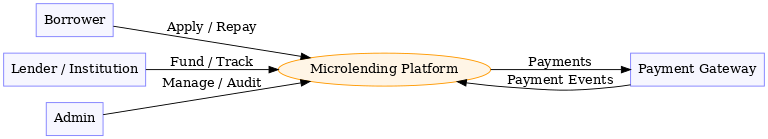
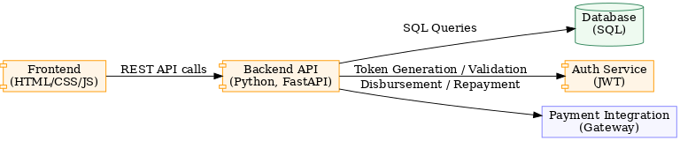
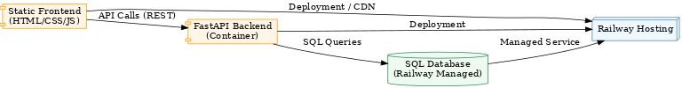
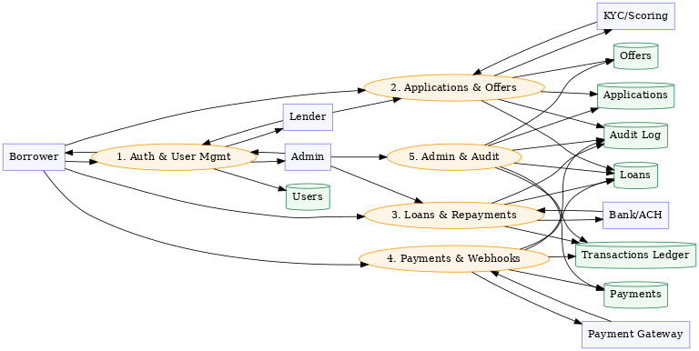

# Architectural Diagram

## 1. Overview
The system is a **microlending platform** that allows borrowers to apply for small loans and lenders (peers or institutions) to fund them.  
It provides loan tracking, repayments, portfolio management, and administrative oversight.
## 2. Context Diagram

**Actors:**  
- **Borrower** – applies for loans and makes repayments  
- **Lender/Institution** – funds loans and tracks portfolio  
- **Admin** – manages users, loans, and compliance  
- **Payment Gateway** – processes deposits and repayments  
## 3. Component Diagram

**Components:**  
- **Frontend** (HTML, CSS, JS) - Static web pages with vanilla JavaScript  
- **Backend API** (Python 3, FastAPI, SQLAlchemy 2.0, PyMySQL)  
- **Database** (MySQL 8.0.42 on AWS RDS)  
  - 8 Core Tables: user, wallet_account, kyc_data, loan_application, loan, transaction_ledger, repayment_schedule, audit_log  
  - 3 Stored Procedures: sp_apply_for_loan, sp_process_repayment, sp_calculate_risk_score  
  - 4 Triggers: user validation/audit, loan audit, wallet audit  
  - Views: v_active_loans, v_portfolio_dashboard, v_user_profile_safe  
- **Auth Service** (JWT-based authentication with PyJWT, SHA256 password hashing)  
- **Payment Integration** (Simulated - metadata stored in database)  
## 4. Deployment Diagram

- **AWS RDS MySQL Hosting**  
- FastAPI backend (Python 3) → Local/Cloud deployment  
- MySQL 8.0.42 database → AWS RDS (`micro-lending.cmvo24soe2b0.us-east-1.rds.amazonaws.com`)  
- Static frontend → Local development server (Node.js/Express)  
- Database connection via PyMySQL and SQLAlchemy  
## 5. Data Flow Diagram

- Borrower submits loan application → Backend API → Database  
- Lender reviews/approves loan → Backend API → Database  
- Repayment → Payment Gateway → Backend API → Database  
- Admin views reports → Backend API → Database  
## 6. Security Considerations
- All communication secured with **HTTPS/TLS**  
- **JWT authentication** with role-based access control (borrower, lender, admin)  
- **Password hashing** using SHA256 for user credentials  
- **Audit logs** for critical actions (triggers on insert/update operations)  
- **Database Roles & Permissions**:  
  - `db_admin` - Full DDL and DML access  
  - `app_user` - DML only on specific tables (no DDL)  
  - `read_only_analyst` - SELECT only for analytics  
- **Constraints & Validation**:  
  - CHECK constraints for credit scores (300-850), roles, statuses  
  - Foreign key constraints with appropriate CASCADE/RESTRICT policies  
  - Triggers for email validation and data normalization  
- **Minimal PII storage** (only what is needed for KYC/loan processing)

## 7. Database Schema Details
**Core Tables (8):**
1. **user** - User accounts with roles (borrower/lender/admin), credit scores, contact info
2. **wallet_account** - User wallet balances with currency support
3. **kyc_data** - KYC verification documents and status
4. **loan_application** - Loan requests with terms and review status
5. **loan** - Active loans with principal, interest, outstanding balance
6. **transaction_ledger** - Append-only transaction history
7. **repayment_schedule** - Loan installment schedule and payment tracking
8. **audit_log** - System audit trail for compliance

**Foreign Key Relationships:**
- wallet_account → user (CASCADE delete)
- kyc_data → user (CASCADE delete), verified_by → user (SET NULL)
- loan_application → user (RESTRICT delete for applicant)
- loan → loan_application (SET NULL), borrower → user (RESTRICT), lender → user (SET NULL)
- transaction_ledger → wallet_account (CASCADE), loan (SET NULL)
- repayment_schedule → loan (CASCADE)
- audit_log → user (SET NULL)  
